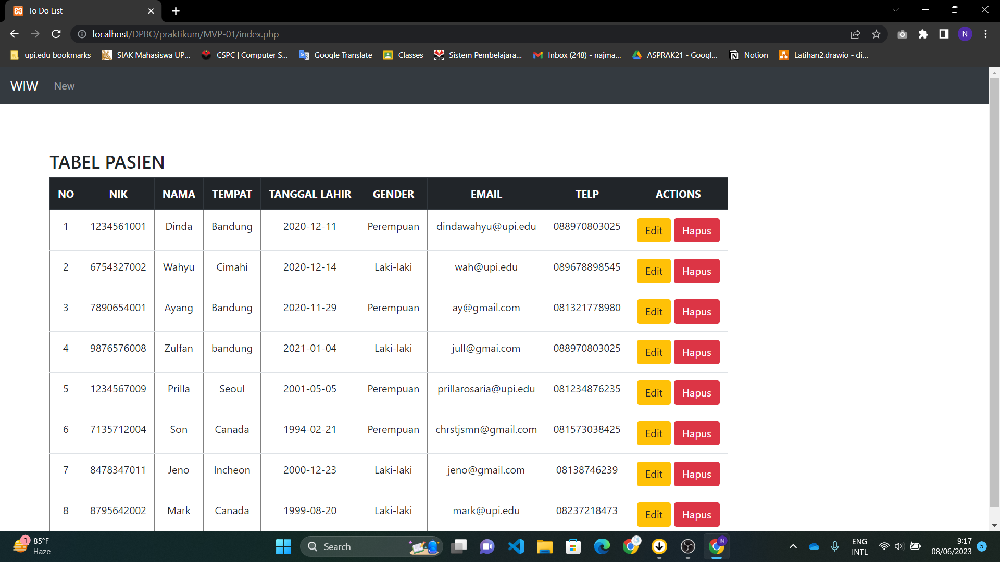

# LP11DPBO2023
Latihan Praktikum 11 Mata Kuliah Desain dan Pemrograman Berorientasi Objek. Program CRUD sederhana dengan PHP GUI menggunakan model arsitektur MVP.

Saya Najma Qalbi Dwiharani dengan NIM 2102843 mengerjakan soal LP 11 dalam mata kuliah Desain dan Pemrograman Berorientasi Objek untuk keberkahanNya maka saya tidak melakukan kecurangan seperti yang telah dispesifikasikan. Aamiin.

## Alur Program

Pada program ini terdapat dua halaman/page:

### 1. Halaman Utama

- Berisi daftar pasien dengan atributnya

### 2. Halaman Add/Update Pasien

- Form untuk menambah pasien baru
- Jika digunakan untuk update maka akan menampilkan data lama yang telah tersimpan

## Dokumentasi

  